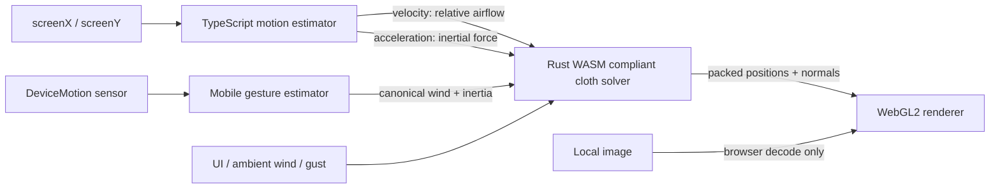

# WASM Cloth Lab

**A real-time Rust/WebAssembly cloth simulation driven by physical browser-window and phone motion.**

Grab the browser window and move it. Window velocity generates relative airflow while acceleration adds inertial force to the cloth. The result is a genuine 3D deformable mesh—not a CSS warp—settling in an ambient breeze.

## Features

- Serial compliant structural, shear, and long-range bending constraints in Rust
- Surface-relative triangle aerodynamic pressure plus light tangential skin drag
- Separately filtered browser velocity and acceleration responses
- Orientation-aware phone acceleration, inertial response, and drift-suppressed gesture wind
- Fixed 120 Hz simulation with capped catch-up work
- WebGL2 textured, lit, double-sided mesh with normals computed in WASM
- Silk, cotton, heavy canvas, nylon, and rubber presets
- Four mesh qualities from 30 × 20 through 100 × 64
- Full-edge, two-point, and top-edge attachments
- Local PNG/JPEG/WebP image import (subject to browser decoding support)
- Debug metrics, gusts, pause, reset, and keyboard controls
- Static, dependency-light GitHub Pages output with arbitrary base-path support

Images selected in the app stay in your browser and are never uploaded. There is no backend, analytics, or tracking.



The 2026 solver research, reproducible ablations, literature bibliography, and production decision are documented in [`docs/research/`](docs/research/DECISION.md).

## Controls

Use **TUNE** for material, quality, attachment, ambient wind, motion-wind/motion-inertia responsiveness, and image selection. On phones, tap **Enable phone motion** when the browser requires permission. `R` resets, `Space` pauses, `F` creates a gust, `D` shows metrics, and `1`–`4` select quality. Browser-window motion works best in a restored desktop window; phone motion, touch, ambient wind, and gusts support mobile use. See [mobile motion architecture and limitations](docs/MOBILE_MOTION.md).

## Development

Requirements: current Rust, `wasm32-unknown-unknown`, `wasm-pack`, and Node.js.

```sh
wasm-pack build crates/cloth-wasm --target web --out-dir ../../web/src/wasm
cd web
npm ci
npm run dev
```

Validation:

```sh
cargo fmt --check
cargo clippy --workspace --all-targets -- -D warnings
cargo test --workspace
cd web && npm test && npm run lint && npm run typecheck
VITE_BASE=/labs/cloth-simulation/ npm run build
```

GitHub Pages is built and deployed by Actions with `VITE_BASE=/wasm-cloth-lab/`. See [architecture](docs/ARCHITECTURE.md), [physics](docs/PHYSICS.md), [browser motion](docs/WINDOW_MOTION.md), and the [manual acceptance procedure](docs/ACCEPTANCE.md).

## Browser support and limitations

The app targets current desktop Chrome, Edge, and Firefox with WebGL2 and progressively enhances current mobile browsers with `DeviceMotionEvent`. Window and sensor reporting differ by browser, OS, and hardware; unsupported/stale input decays safely. No physical mobile browser is claimed as tested yet. Self-collision, object collision, tearing, fit/crop image modes, and force-arrow rendering are deferred. See [compatibility](docs/BROWSER_COMPATIBILITY.md). Future website integration keeps this repository independent; see [integration](docs/INTEGRATION.md).

Licensed under MIT.
